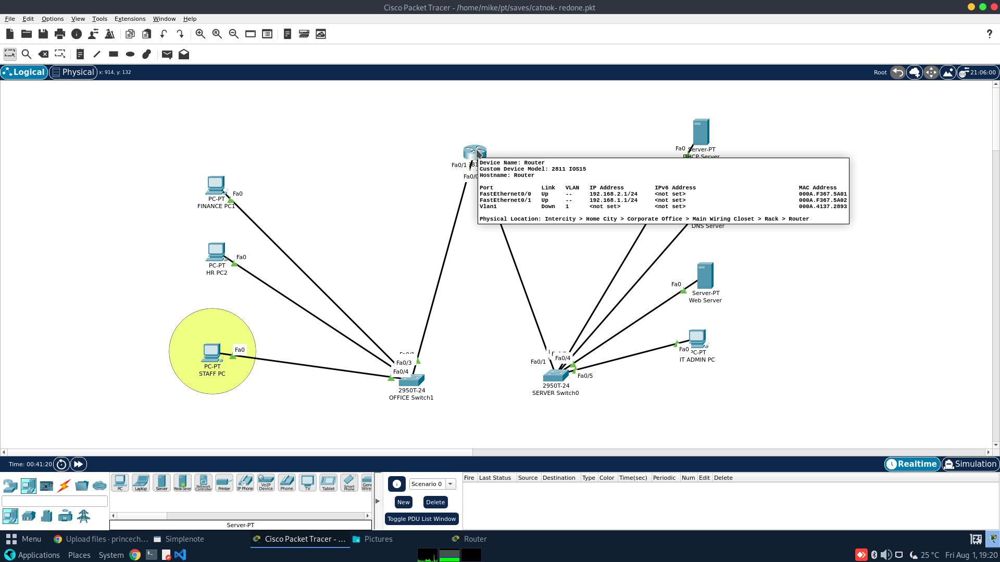

### PROJECT 001 Catnork NETWORK  – Designing a Secure Internal Network for Improved Operational Efficiency 

### **Project Objective**
- Design and build a functioning organizational network using a router, switches, PCs, and servers
- Implement DHCP and static addressing on the devices 
- apply Extended Access Control Lists (ACLs) to
restrict HTTP access  
- Allow only one laptop to access the internal webserver while blocking all others from doing so  
- Ensure that other services like DHCP, DNS, and general
connectivity remain functional
 - Launch Internal File Server with access to HR Dept but Finance Dept are restricted to the File Server
 

### **COMPUTERS & Hardware components required-** 
- Cisco Router 2811
- CAT 6 cables
- 2 Cisco Switches for HR Dept & IT Dept
- 1 DNS Server 
- 1 DHCP Server
- 1 Web Server
- Laptops and computers for the staff 

### SETTING UP THE NETWORK INFRASTRUCTURE
### ** Network Connection** 
- Identify and position all hardware components appropriately consideration safety and high availability and functionality 
- **Servers** in designated server room
- **Switches** in the appropriated position for each office / department that will enhance ease of cabling and connection for laptop and computers for staff
- Run **cat 6 cable and RJ 45 connectors** for the network connection to all hardware components

### ** Network Configuration** 
**Static IP Addresses** will be assigned to the following devices: 

- CISCO ROUTER 
- DHCP SERVER 
- DNS SERVER 
- WEB SERVER  

**Note** Network switches don't need ip addresses

THE ROUTER is going to be the connecting device between the switches connecting different section or segment of the infrastructure serving each departments (offices) 
See the diagram below 

**ASSIGN IP ADDRESS** TO THE OTHER DEVICES ON THE FIRST SECTION OF THE OFFICE with the **192.168.1.0/24** ranges 
that is with the ip address ranging from **1 to 254** 
that is   
**192.168.1.1 - 192.168.1.254**   
but we are reserving 1 to 9 for fixed ips to be used by servers and any dedicated devices  
so we will use **192.168.1.10 - 192.168.1.254**  
for any devices that will connect to the network  
and   
a subnet of **255.255.255.0 (/24)** 

the **Gateway** device will be the CISCO ROUTER which we will assign **192.168.1.1** and **192.168.2.1**
because internet access passes or routes through it 

**DNS** resolves all devices or hosts on the network to a hostname and an ip address for easy discovery and location 
it will be assign a fixed IP of **192.168.2.3**

**DHCP** that is responsible to assign ip addresses to all hosts or devices on the network  
So the cisco router  will have 2 LAN ports to link the 2 switches LAN1 & LAN2 with the network configuration below 

|  PORTS | LAN 1 |  LAN 2|
| ----- | --- |---|
| IP ADDRESS | 192.168.1.1 | 255.255.255.0 
| SUBNET   |  255.255.255.0  | 255.255.255.0
| GATEWAY  |  192.168.1.1  | 192.168.2.1
| DHCP  |  192.168.2.2  | 192.168.2.2
| DNS  |  192.168.2.3  | 192.168.2.3

AS SHOWN BELOW 

So with the settings above we begin the 

##**ASSIGN IP ADDRESS CONFIGURATION OF ALL THE NETWORK DEVICES**

CISCO ROUTER IP CONFIGURATION

connect to the router 
enter the command line Interface 
and launch terminal
 from the prompt enter the commands below step by step
 
####### $> configure terminal or conf t  
then Press Enter  

Router>  
Router>*enable*  
Router#  
Router#*configure terminal*  
Enter configuration commands, one per line.  End with CNTL/Z.  
Router(config-if)#  

MAIN_ROUTER(config)#  
ROUTER(config)#*hostname MAIN_ROUTER*  
MAIN_ROUTER(config)#  
*exit*  

SET IP FOR THE LAN 1  

exit  
MAIN_ROUTER(config)#*interface FastEthernet0/0*  
MAIN_ROUTER(config-if)#*ip address 192.168.1.1 255.255.255.0*  
MAIN_ROUTER(config-if)#  

SET IP FOR LAN 2

*exit*
MAIN_ROUTER(config)#*interface FastEthernet0/1*  
MAIN_ROUTER(config-if)#*ip address 192.168.2.1 255.255.255.0*  
MAIN_ROUTER(config-if)#
 
 RESULT IS SHOW BELOW 
 
 

 ________________________________________
 
 Similarly 
 we will use the configurations below for the DHCP. DNS AND WEB SERVERS too
 
| Device | IP ADDRESS | GATEWAY | SUBNET | DNS |
| ----- | --- |---| ---| ---|
| DHCP SERVER | 192.168.2.2 | 192.168.2.1| 255.255.255.0| 192.168.2.3|  
| DNS SERVER | 192.168.2.3 | 192.168.2.1| 255.255.255.0| 192.168.2.3|  
| WEB SERVER | 192.168.2.4 | 192.168.2.1| 255.255.255.0| 192.168.2.3|  

### Assigning IP for 
### DHCP SERVER CONFIGURATION

### DNS SERVER CONFIGURATION

### WEB SERVER CONFIGURATION

### SETTING UP THE ACCESS CONTROL ON THE ROUTER ### 

ACL
Now Let’s Configure an Extended ACL Using host

•	Standard ACLs are simple but can’t filter by service/port.
•	Extended ACLs are powerful — use them when you need precision.
Standard ACL	1–99, 1300–1999	Source IP only
Extended ACL	100–199, 2000–2699	Source IP, Destination IP, Protocol, Port

**Scenario**  
Only Laptop0 (IP: 192.168.1.25) should be able to access the Webserver (IP: 192.168.2.4) using HTTP. 
Everyone else should be blocked from the webserver, but still allowed to use other services like DHCP or DNS.
________________________________________
## **Step-by-Step Configuration**  

**Step 1:** Enter Router CLI
*enable*  
*configure terminal*  

**Step 2:** Create ACL Using host  
*access-list 100 permit tcp host 192.168.1.25 host 192.168.2.4 eq 80*  
*access-list 100 deny tcp any host 192.168.2.4 eq 80*  
*access-list 100 permit ip any any*  

**🔎 Explanation:**  
•	permit tcp host 192.168.1.25 host 192.168.2.4 eq 80:   
Allow HTTP traffic from Laptop0 to Webserver  
•	deny tcp any host 192.168.2.4 eq 80: Block HTTP from all other devices to Webserver  
•	permit ip any any: Allow all other traffic (DHCP, DNS, ping, etc.)  
________________________________________
## **Step 3:**   
Apply the ACL to the Correct Interface
If the Webserver is connected to interface *GigabitEthernet0/1:*  
*interface Fa0/1*  
*ip access-group 100 out***
*exit*  

This tells the router: "Before traffic goes to the webserver, apply ACL 100."
________________________________________
## **Step 4: Confirm & Test**  
Test in browser:
Device	Action	Result
Laptop0  	
Visit http://192.168.2.4  ✅ Allowed
Other PCs	  
Visit http://192.168.2.4	❌ Blocked
________________________________________
Final Notes:
•	Standard ACLs are simple but can’t filter by service/port.
•	Extended ACLs are powerful  use them when you need precision.
•	Always apply ACLs as close as possible to where they are effective:
o	Standard ACL → apply close to the destination
o	Extended ACL → apply close to the source

